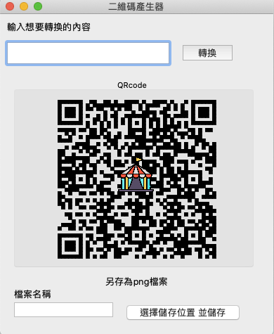

# QRcode Generator

## Environment
* C++
* QT
* Test environment
  * MacOs Catalina 10.15.6

## Getting Started
* install third part lib `qrencode`
  *   from https://fukuchi.org/works/qrencode/

## Introduction
1. Qt 構建Ui
2. 生成自訂內容的QRcode
3. 包含一張中心icon
4. 可以在自訂名稱並在local儲存成`png`

5. QRcode Encode mode
  * version : 7
  * level : QR_ECLEVEL_Q
  * Mode : QR_MODE_8 (using utf8, 確保使用可中文編碼)
  * casesensitive : true
  
  
